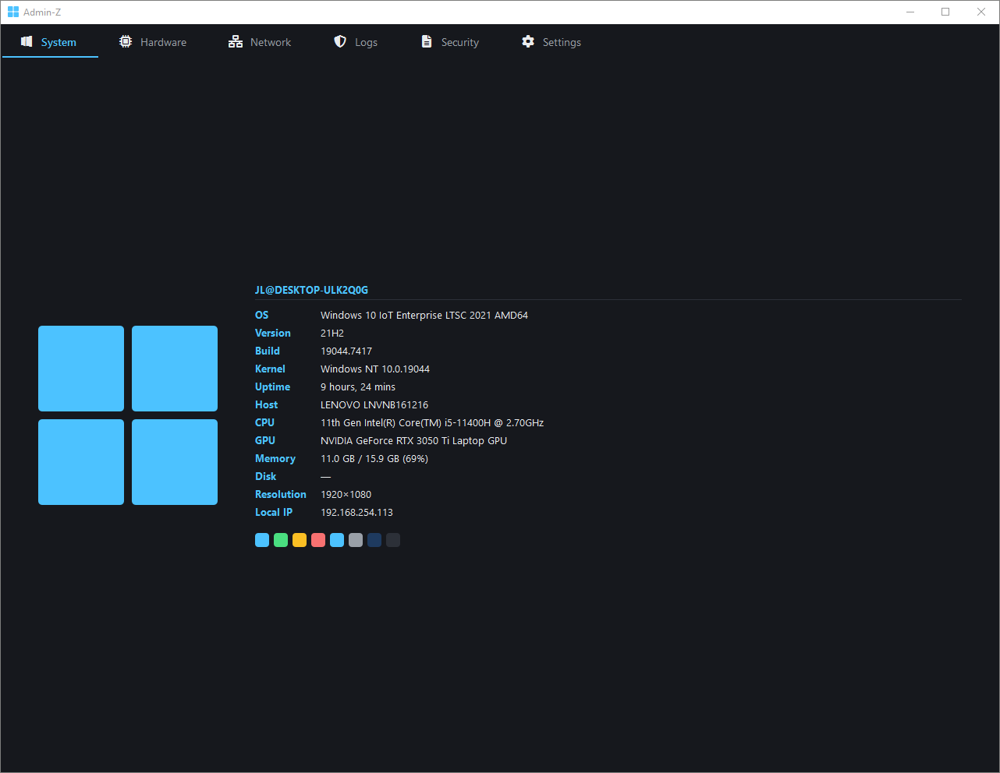
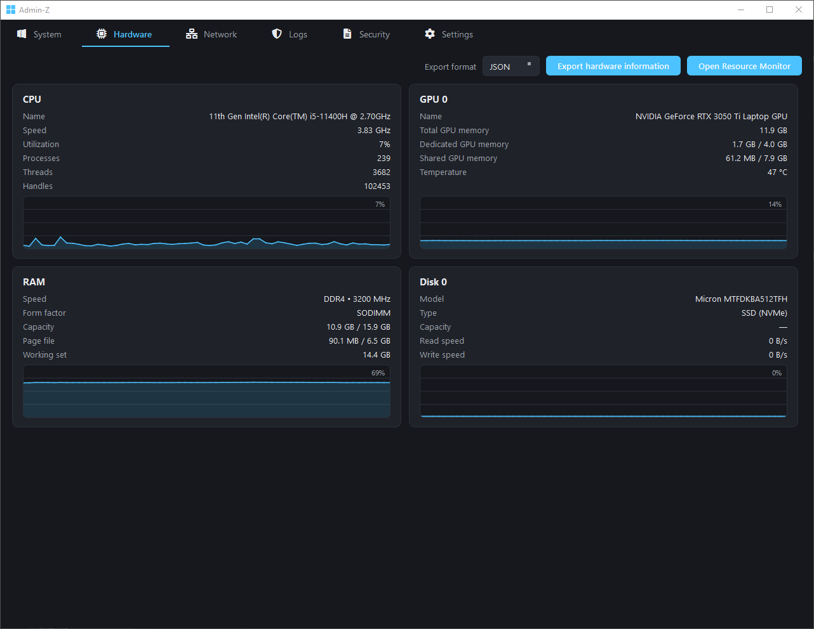
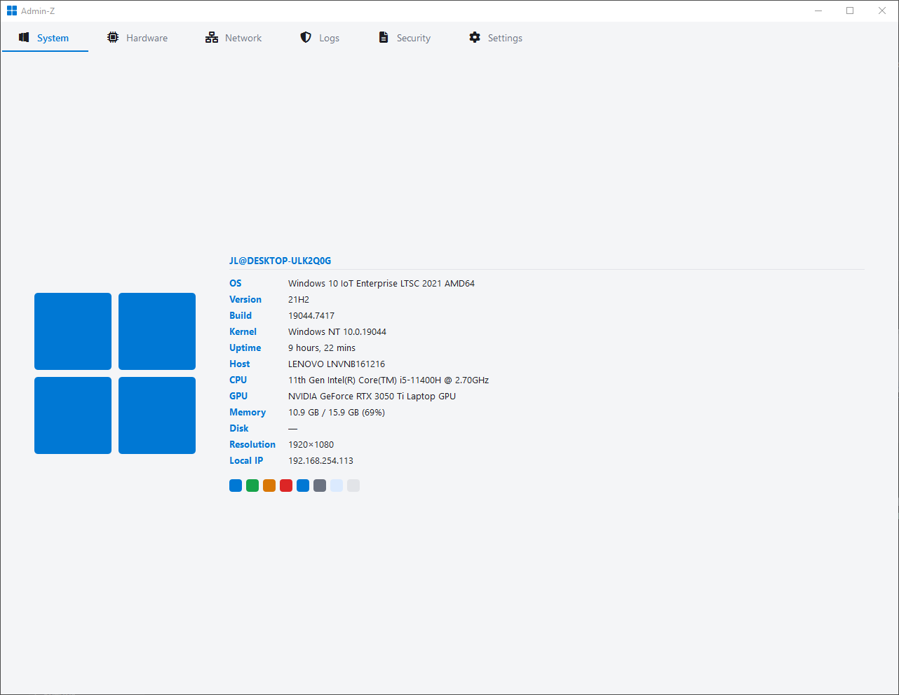
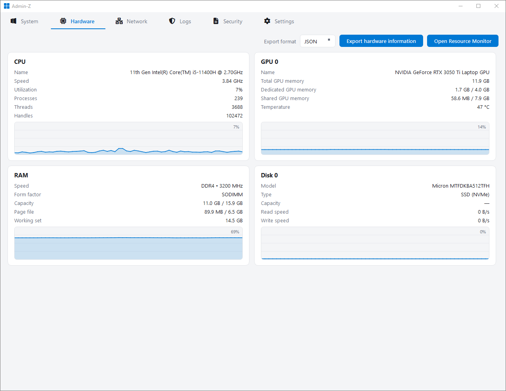

# Admin-Z

A clean, minimal system administration dashboard for Windows 10 and 11, built with Python and PyQt6. Admin-Z brings live hardware telemetry, network monitoring, Windows Event Logs, and a full security overview together in a single window, with one-click exports to JSON, XML, and YAML.

## Screenshots





<details>
<summary>Light mode</summary>





</details>

## Installation

**Requirements:** Windows 10/11 and Python 3.11 or newer.

1. Clone the repository:

   ```
   git clone https://github.com/admin-z/admin-z.git
   cd admin-z
   ```

2. Install the dependencies:

   ```
   pip install PyQt6 psutil pywin32 QtAwesome
   ```

   Optionally, install PyYAML for nicer YAML exports (a built-in fallback is used otherwise):

   ```
   pip install PyYAML
   ```

3. Run the application:

   ```
   python admin-z.py
   ```

> **Note:** Admin-Z requires administrator privileges (needed to read the Security event log, process tokens, and thermal sensors). It requests elevation via UAC on startup; if elevation is declined, the app shows an error and exits.

## Features

- **System**: a neofetch/fastfetch-style overview: OS logo alongside OS version and build, kernel, uptime, motherboard, CPU, GPU, memory, disk, resolution, and local IP.
- **Hardware**: live-updating cards for CPU (clock, utilization, processes/threads/handles, temperature), GPU (dedicated/shared memory, temperature), RAM (speed, form factor, page file, working set), and every physical disk (type, capacity, read/write speeds), each with a utilization line graph.
- **Network**: one page per active adapter (added/removed live as adapters come and go) with IP addresses, auto-scaling send/receive throughput graphs, active TCP connections, and listening ports with their owning processes.
- **Logs**: the latest 1,000 events from the Application, Setup, and System logs in an Event Viewer-style sortable table, with checkbox multi-selection (Shift+click ranges, select-all header) and timestamped `.txt` export. Auto-refreshes on a configurable interval.
- **Security**: Security event log with audit keywords, Windows Defender status and threat history, firewall profiles and rule counts, local user accounts with privilege levels and failed-login counts, processes running elevated, startup programs, and the current UAC level.
- **Exports**: hardware and network specifications exportable as JSON, XML, or YAML; log selections exportable as tab-separated text, all with a configurable destination folder.
- **Quality of life**: light/dark theme with follow-system option, configurable refresh rates (graphs and logs independently), always-on-top mode, quick-launch buttons for Resource Monitor, Event Viewer, Windows Security, and firewall settings, and settings persisted to `settings.json`.

## License

This project is licensed under the [Apache License 2.0](https://www.apache.org/licenses/LICENSE-2.0).
